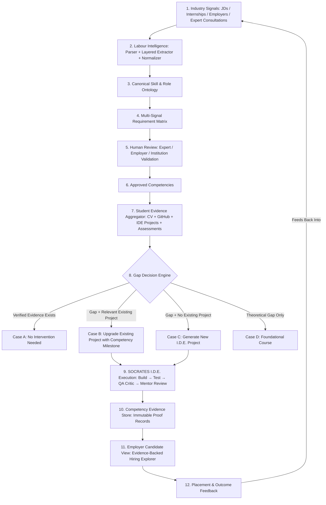

# SOCRATES Labour-Market Intelligence & Competency Alignment Architecture

## 1. Executive Summary & Core Paradigm
This document outlines the architecture, data flow, ontology models, gap decision engine, and closed-loop feedback design implemented in **SOCRATES I.D.E. / P-S**.

The fundamental architectural principle is:
```
           CURRENT SOCRATES ENGINE & I.D.E.
                          ↓
                    REMAINS INTACT
                          ↓
             NEW LABOUR INTELLIGENCE LAYER
                          ↓
FEEDS REQUIREMENTS INTO EXISTING EXECUTION INFRASTRUCTURE
```

---

## 2. End-to-End Closed Feedback Loop



---

## 3. Database Schema & Data Models

All models are integrated directly into SQLite (`node:sqlite` `DatabaseSync`) with zero external native compilation dependencies:

### 3.1 Industry Signals (`industry_signals`)
- `id`: Text primary key (e.g. `sig_msft_200041085`).
- `source_type`: `job_description`, `internship`, `employer_form`, `expert_input`, `hiring_drive`, `placement_outcome`.
- `source_name`, `source_url`, `organization`, `role_title`, `location`, `published_at`, `collected_at`.
- `raw_content`: Exact unmodified raw text.
- `parsed_content`: Structured JSON with detected sections, skill extractions, and confidence.
- `status`: `pending`, `processed`, `reviewed`, `archived`.
- `created_by`: Foreign key to `users(id)`.

### 3.2 Canonical Ontology (`roles_ontology`, `skills_ontology`, `skill_aliases`, `skill_relationships`)
- **Roles**: `id` (e.g. `software-engineering-intern`, `backend-engineer`), `title`, `category`, `version`.
- **Skills**: `id` (e.g. `docker`, `oop`, `dsa`, `observability`), `name`, `category`, `proficiency_definitions` (JSON), `version`.
- **Aliases**: `skill_id`, `alias` (e.g. maps "Docker containers", "Docker Containerization", "Dockerfiles" -> `docker`).
- **Relationships**: `parent_skill_id`, `child_skill_id`, `relationship_type` (e.g. `contains`, `prerequisite`).

### 3.3 Requirement Matrix (`labour_requirements`)
- `id`, `signal_id`, `role_id`, `skill_id`, `requirement_type` (`required`, `preferred`).
- `proficiency` (`beginner`, `intermediate`, `advanced`).
- `experience_years`, `source_reference`, `evidence_quote`, `extraction_method`, `confidence`.
- `status`: `OBSERVED`, `EMERGING`, `REVIEW_REQUIRED`, `EXPERT_VALIDATED`, `APPROVED`, `DECLINING`, `REJECTED`.
- **Multi-signal Demand Counters**:
  - `job_signal_count`
  - `internship_signal_count`
  - `employer_signal_count`
  - `expert_signal_count`
  - `trend_score`

### 3.4 Human Validation Log (`requirement_reviews`)
- `id`, `requirement_id`, `reviewer_id`, `reviewer_role`, `decision` (`APPROVE`, `MODIFY`, `REJECT`, `REQUEST_MORE_EVIDENCE`), `comments`, `suggested_proficiency`, `suggested_learning_outcomes`, `suggested_evidence_requirements`, `version`.

### 3.5 Student Competency Profiles (`student_competency_profiles`)
- Multi-tier evidence states:
  - `CLAIMED`: Stated on CV / resume.
  - `OBSERVED`: Detected in public GitHub repositories / commits.
  - `ASSESSED`: Passing technical quizzes / assessments.
  - `VERIFIED`: Proven through working I.D.E. code, automated tests, QA Critic review, and mentor sign-off.
- `student_id`, `skill_id`, `status`, `claimed_source`, `observed_source`, `assessed_source`, `verified_source`, `proficiency_level`, `confidence_score`.

### 3.6 Competency Evidence Store (`competency_evidence_store`)
- `id`, `learner_id`, `skill_id`, `role_id`, `project_id`, `milestone_id`, `task_id`, `assessment_id`.
- `evidence_type`: `source_code`, `test_results`, `execution_result`, `project_artifact`, `technical_explanation`, `ide_validation`.
- `evidence_location`: File path / workspace URI / Git commit.
- `evidence_payload`: Structured JSON with test output, code coverage %, health probe logs, QA score, mentor notes.
- `reviewer_id`, `rubric_version`, `competency_version`, `status` (`VERIFIED`).

### 3.7 Project Upgrades (`project_upgrades`)
- `id`, `base_project_id`, `student_id`, `target_skill_id`, `target_requirement_id`, `upgrade_title`, `upgrade_milestone_id`, `status`, `generated_by`.

### 3.8 Closed-Loop Outcome Feedback (`employer_feedback_records`)
- `id`, `employer_id`, `candidate_id`, `role_id`, `hiring_status` (`hired`, `internship_completed`, `interviewed`, `rejected`), `competency_feedback` (JSON), `gap_notes`, `readiness_rating` (1-5), `communication_rating` (1-5).

---

## 4. Layered Extraction Pipeline

```
Raw Signal / JD
      ↓
Document Parser & Text Cleaner
      ↓
Section Segmentation (Qualifications, Responsibilities, About Role)
      ↓
Layer 1: Deterministic Rules & Dictionaries (Exact Regex & Canonical Aliases)
      ↓
Layer 2: Pattern Matching & Experience Years Extraction
      ↓
Layer 3: LLM Fallback (Constrained JSON with Zero Hallucination Prompting)
      ↓
Layer 4: Canonical Ontology Normalization
      ↓
Layer 5: Provenance & Requirement Matrix Record Creation
```

---

## 5. Intelligent Gap Decision Tree

When an industry requirement is selected for a student:

1. **Check Evidence Store**:
   - If verified evidence already exists with status `VERIFIED` → **`NO_ACTION`** (no redundant project generated).
2. **Check Existing Projects**:
   - If student already has a relevant base repository (e.g. Student built a "REST API Microservice" and needs "Docker" or "Observability") → **`UPGRADE_EXISTING_PROJECT`**.
   - The upgrader injects a targeted production milestone (e.g. `Production Docker Containerization & Health Probes`) and daily tasks into the existing project without deleting or duplicating existing code.
3. **If No Relevant Base Project Exists**:
   - → **`NEW_IDE_PROJECT`** (Generates a clean project template matching the competency requirement).
4. **If Theoretical Gap Only**:
   - → **`COURSE`** (Provides prerequisite learning modules).

---

## 6. Execution & Verification Flow in SOCRATES I.D.E.

1. Student opens project in **SOCRATES I.D.E.**.
2. Completes the injected upgrade milestone tasks:
   - `Task 1: Author Production Dockerfile & .dockerignore`
   - `Task 2: Container Build & Runtime Validation`
   - `Task 3: Environment Configuration & Health Probe Endpoint`
   - `Task 4: Automated Container Testing & Observability Telemetry`
3. Student runs tests and triggers **QA Critic Validation** (`/api/v1/tasks/:id/submit`).
4. Upon passing all criteria and mentor sign-off:
   - An immutable record is created in `competency_evidence_store`.
   - `student_competency_profiles` status is updated to `VERIFIED`.
5. Employer sees verified status with clickable evidence in the **Employer Candidate Explorer**.
6. Employer provides hiring outcome feedback, which creates an outcome signal and increments employer demand in the **Requirement Matrix** — completing the continuous feedback loop.

---

## 7. API Reference

All endpoints are mounted under `/api/v1/labour`:

| Endpoint | Method | Description |
|---|---|---|
| `/signals/ingest` | `POST` | Uploads and processes a raw JD or industry signal |
| `/signals` | `GET` | Lists all ingested industry signals with source provenance |
| `/signals/:id` | `GET` | Retrieves detailed signal with extracted sections and skills |
| `/ontology/skills` | `GET` | Returns canonical skills, aliases, and proficiency definitions |
| `/ontology/roles` | `GET` | Returns canonical role hierarchies |
| `/ontology/normalize` | `POST` | Normalizes arbitrary raw skill strings to canonical skill IDs |
| `/requirements` | `GET` | Retrieves the multi-signal requirement matrix |
| `/requirements/:id/review` | `POST` | Records human expert validation (APPROVE, MODIFY, REJECT) |
| `/students/:id/evidence` | `GET` | Returns multi-tier student evidence and competency states |
| `/students/:id/gap-analysis` | `POST` | Executes gap decision tree for target competency |
| `/projects/:id/upgrade-plan` | `POST` | Generates a non-destructive project upgrade plan |
| `/projects/:id/apply-upgrade` | `POST` | Injects upgrade milestone & tasks into existing project DB |
| `/evidence` | `GET` | Lists verified competency evidence records |
| `/evidence/record` | `POST` | Commits verified evidence record to store |
| `/employer/candidates` | `GET` | Retrieves candidates with evidence-backed competencies |
| `/employer/feedback` | `POST` | Submits employer placement feedback to close the feedback loop |
| `/institution/curriculum-analysis` | `GET` | Returns curriculum review candidate analytics |

---

## 8. Verification & Test Suite

The automated test suite in `backend/tests/labour_intelligence_test.js` verifies:
- Canonical alias normalization (`Docker Containerization`, `Dockerfiles` -> `docker`)
- Deterministic section segmentation and experience parsing
- Multi-signal requirement matrix aggregation
- Human review state transitions
- Critical Gap Decision: `UPGRADE_EXISTING_PROJECT` for REST API + Docker vs `NO_ACTION` for already verified evidence vs `NEW_IDE_PROJECT` for missing project
- Ingestion of Dockerization milestones into SQLite tables
- Evidence Store recording and student profile status update to `VERIFIED`
- Employer feedback ingestion into the continuous feedback loop
