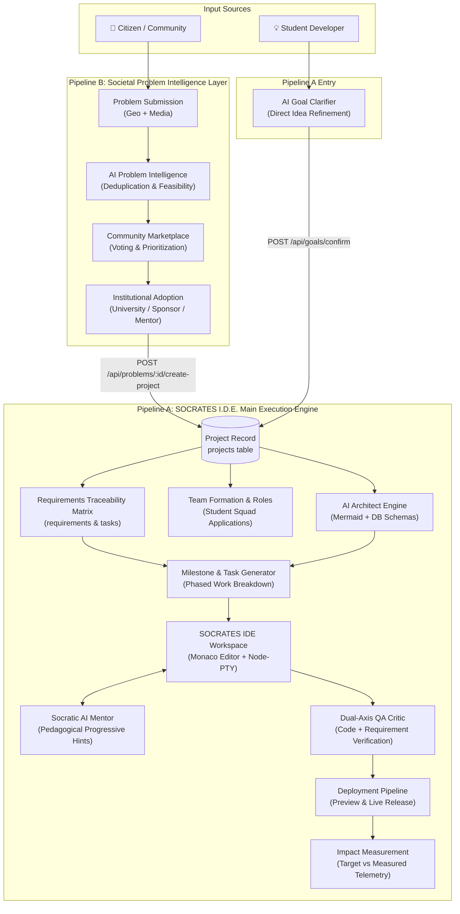
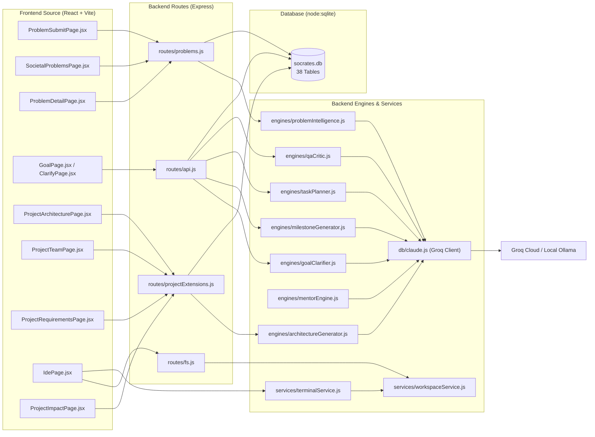
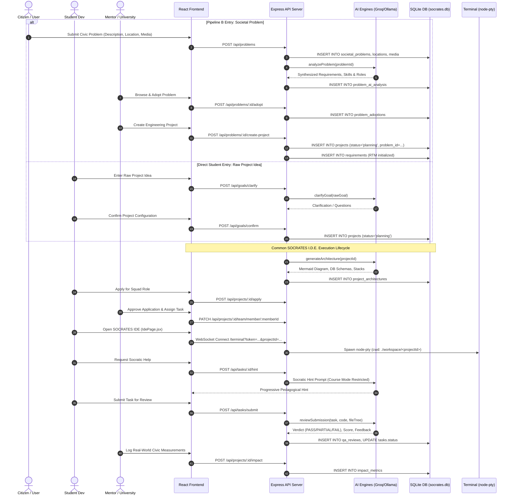

# PROJECT-SKILL / SOCRATES — SOCRATES I.D.E.

## Complete System Architecture & Actual Implementation

> **Pipeline B: Societal Problem Intelligence → Pipeline A: SOCRATES I.D.E. Execution Engine**  
> *Two input paths feeding one common, traceable, team-based execution architecture.*

---

## 1. System Overview

### 1.1 What PROJECT-SKILL / SOCRATES Is
**PROJECT-SKILL (SOCRATES)** is an AI-powered project building, verification, and civic innovation engineering platform. It eliminates theoretical learning inertia ("tutorial hell") by providing a structured, verifiable bridge between software engineering education and urgent real-world problems.

### 1.2 What SOCRATES I.D.E. Means in this Repository
In this repository, **SOCRATES I.D.E.** is the central execution environment (`frontend/src/pages/IdePage.jsx`, `backend/src/services/terminalService.js`, `backend/src/services/workspaceService.js`, `backend/src/engines/mentorEngine.js`). It is not merely a syntax editor; it is a constrained development environment combining:
1. **In-Browser Monaco Editor** for live code authoring.
2. **Interactive PTY Terminal** (`node-pty` over WebSockets) for sandboxed command execution.
3. **Socratic AI Mentor Engine** that enforces pedagogical guardrails—refusing to write full copy-paste solutions, instead asking probing questions, delivering progressive hints, and evaluating architectural security.
4. **Dual-Axis QA Critic Engine** that evaluates code submissions against both technical correctness and original requirements.

### 1.3 The Two Input Paths: Pipeline B and Student Direct Entry
The repository is architected around two input funnels converging on one execution core:

```text
                INPUT SOURCES
                     │
        ┌────────────┴────────────┐
        ▼                         ▼
  PROJECT IDEA             SOCIETAL PROBLEM
 (Student Entry)          (Pipeline B Entry)
        │                         │
        ▼                         ▼
 GOAL CLARIFIER          PROBLEM INTELLIGENCE
(goalClarifier.js)      (problemIntelligence.js)
        │                         │
        │                  VALIDATION / ADOPTION
        │                 (Review / Adoption / RTM)
        │                         │
        └────────────┬────────────┘
                     ▼
             PROJECT RECORD (`projects`)
                     │
                     ▼
         SOCRATES I.D.E. CORE ENGINE
                     │
              AI ARCHITECT
        (architectureGenerator.js)
                     │
              TEAM FORMATION
       (project_teams & applications)
                     │
            TASK DECOMPOSITION
        (milestones & tasks tables)
                     │
           TRACEABLE EXECUTION
     (Monaco + PTY Terminal + Workspace)
                     │
              DUAL-AXIS QA
          (qaCritic.js & RTM QA)
                     │
                DEPLOYMENT
         (Docker / Preview / Host)
                     │
              IMPACT METRICS
          (impact_metrics table)
```

- **Pipeline B (Societal Problem Intelligence / Acquisition Layer)**: Ingests unstructured, emotional civic complaints from citizens, panchayats, and NGOs; applies automated AI synthesis, deduplication, categorization, and feasibility scoring; subjects them to community prioritization and institutional adoption; and converts them into structured software project specifications.
- **Pipeline A (SOCRATES I.D.E. Main Execution Engine)**: Ingests either a validated societal problem from Pipeline B **or** a direct raw project idea from a student, generates system architecture and database schemas, structures team squads, decomposes work into traceable milestones and atomic tasks, guides students through Socratic mentoring in Monaco/Terminal, and verifies code via Dual-Axis QA before measuring deployment impact.

### 1.4 Why Pipeline B Feeds Pipeline A
Pipeline B is strictly an **acquisition and intelligence funnel**; it does not execute code, manage terminal sessions, or review Git commits. Once a societal problem is validated and adopted, calling `POST /api/problems/:id/create-project` creates a standard record in the `projects` table with `projects.problem_id` populated and initializes entries in the `requirements` table. At that exact handoff point, the problem becomes a project and is governed by Pipeline A's execution lifecycle.

---

## 2. System Boundaries

### 2.1 Frontend Boundary
- **Framework**: React 18.3.1 SPA built with Vite 5.3.4 and styled with Vanilla CSS tokens and Lucide React icons.
- **Routing**: `react-router-dom` v6.23.1 managing 24 pages across Student, Mentor, Citizen, and Admin roles.
- **Client Components**:
  - **Code Editing**: `@monaco-editor/react` (v4.7.0) with custom syntax highlighting and file tree state.
  - **Terminal Emulation**: `@xterm/xterm` (v6.0.0) with `@xterm/addon-fit` rendering ANSI terminal streams.
  - **Mapping & GIS**: Leaflet integration for geolocation selection and civic problem heatmaps.
  - **State Management**: `zustand` (v4.5.4) handling auth session tokens, user profile, and active project state.

### 2.2 Backend Boundary
- **Runtime**: Node.js v22.12+ runtime utilizing native `node:sqlite` (`DatabaseSync`) for persistent zero-dependency storage.
- **HTTP Server**: Express 4.19.2 exposing REST endpoints under `/api`, `/api/auth`, `/api/problems`, `/api/projects`, `/api/fs`, `/api/media`, and `/api/preview`.
- **Real-Time Communication**: `ws` (v8.19.0) WebSocket servers mounted on the same HTTP server instance handling interactive terminal sessions and real-time collaboration.
- **Process Management**: `node-pty` (v1.1.0) spawning pseudo-terminals (`powershell.exe` on Windows, `bash` on Linux/macOS).

### 2.3 AI Layer Boundary
- **Primary Inference Broker**: `backend/src/services/aiService.js` routing to Groq Cloud or local Ollama based on `config.LLM_PROVIDER`.
- **Underlying Client**: `backend/src/db/claude.js` (legacy named shim) executing HTTP POST requests against Groq's OpenAI-compatible endpoint (`https://api.groq.com/openai/v1/chat/completions`) or local Ollama (`${OLLAMA_BASE_URL}/v1/chat/completions`).
- **Models Used**:
  - Cloud: `llama-3.3-70b-versatile` (default for reasoning, planning, and QA) and `llama-3.2-11b-vision-preview` (multimodal).
  - Local: `qwen2.5-coder:7b` or `llama3.1:8b` via Ollama.
- **Domain Engines**: `goalClarifier.js`, `problemIntelligence.js`, `architectureGenerator.js`, `milestoneGenerator.js`, `taskPlanner.js`, `mentorEngine.js`, `qaCritic.js`.

### 2.4 Execution & Sandbox Boundary
- **Workspace Storage**: `backend/src/services/workspaceService.js` creates project-isolated directories under `./workspace/<projectId>`.
- **Path Sanitization**: Directory traversal protection strictly validates that resolved paths start with `BASE_WORKSPACE`.
- **Command Security**: `strictSecurityFilter` in `mentorEngine.js` and `terminalService.js` authorization checks block destructive commands (`rm -rf`, `eval`, `child_process`, `wget`).

### 2.5 Persistence Layer Boundary
- **Database Engine**: SQLite running in WAL mode with enforced foreign keys via Node.js native `node:sqlite` `DatabaseSync`.
- **Physical File**: Stored at `./data/socrates.db` (or path configured in `config.DB_PATH`).
- **Media Storage**: Uploaded files stored in `./uploads/` with metadata recorded in the `problem_media` table.

### 2.6 Security & RBAC Boundary
- **Authentication**: Stateless JSON Web Tokens (JWT) signed using `config.JWT_SECRET`, transmitted via HTTP `Authorization: Bearer <token>` or WebSocket query param `?token=...`.
- **Role Guards**: `backend/src/middleware/role_middleware.js` enforcing roles: `student`, `mentor`, `citizen`, `university`, `admin`.

### 2.7 External Services Boundary
- **Groq API**: Cloud LLM inference (`https://api.groq.com`).
- **Ollama**: Optional local inference (`http://localhost:11434`).
- **Google OAuth**: Optional social authentication via `@react-oauth/google`.
- **SMTP Server**: Email verification and password resets via `nodemailer`.

---

## 3. Complete Architecture

### 3.1 Unified Conceptual Architecture



### 3.2 Physical File Architecture Mapping



---

## 4. Pipeline B — Actual Implementation

### 4.1 Problem Submission Flow
The citizen submission workflow allows non-technical community members to submit real-world problems with geolocation and evidence attachments.

```text
Citizen UI (ProblemSubmitPage.jsx)
   ↓ HTTP POST multipart/form-data
Backend Route (POST /api/problems in routes/problems.js)
   ↓ requireRole('citizen', 'admin') + payload validation
Database Transaction (db.prepare INSERT INTO societal_problems, problem_locations, problem_media)
   ↓ Background Execution
AI Problem Intelligence (engines/problemIntelligence.js)
   ↓ Persistence
problem_ai_analysis & problem_duplicates tables
```

#### Detailed Stage Breakdown:
- **Frontend Page**: [`frontend/src/pages/ProblemSubmitPage.jsx`](file:///c:/Project-Skill/P-S/frontend/src/pages/ProblemSubmitPage.jsx)
  - Provides a 4-step wizard: Basic Details, Categorization & Urgency, Geolocation (interactive map), and Media Upload.
- **Backend Route**: `POST /api/problems` in [`backend/src/routes/problems.js`](file:///c:/Project-Skill/P-S/backend/src/routes/problems.js#L78-L165)
- **Role Guard**: `requireRole('citizen', 'admin')`
- **Request Payload**:
  ```json
  {
    "title": "Severe water contamination in Ward 4",
    "description": "Tap water is brown with strong sulfur odor causing gastrointestinal illness.",
    "problem_type": "Water & Sanitation",
    "category_id": "cat_water",
    "urgency": "high",
    "severity": "severe",
    "people_affected": 850,
    "geographic_scope": "local",
    "privacy_level": "public",
    "expected_impact": "Clean drinking water for 200 households",
    "latitude": 12.9716,
    "longitude": 77.5946,
    "address": "4th Cross, Ward 4",
    "city": "Bengaluru",
    "state": "Karnataka",
    "pincode": "560001",
    "media_files": []
  }
  ```
- **Database Operations**:
  1. `INSERT INTO societal_problems` (`id`, `user_id`, `title`, `description`, `problem_type`, `status = 'SUBMITTED'`, etc.).
  2. `INSERT INTO problem_locations` (`id`, `problem_id`, `latitude`, `longitude`, `address`, `city`, `state`, `pincode`).
  3. `INSERT INTO problem_media` for each uploaded photo/video.

---

## 5. Pipeline B — AI Problem Intelligence

Implemented in [`backend/src/engines/problemIntelligence.js`](file:///c:/Project-Skill/P-S/backend/src/engines/problemIntelligence.js).

### 5.1 Invocation & Prompt Construction
The engine is triggered automatically on problem submission or via `POST /api/problems/:id/analyze`. It invokes `callClaudeJSON` in [`backend/src/db/claude.js`](file:///c:/Project-Skill/P-S/backend/src/db/claude.js) using the `SYSTEM_PROMPT`:

```javascript
const SYSTEM_PROMPT = `You are the SOCRATES Societal Problem Intelligence Engine.
Your task is to transform informal, emotional, or unstructured citizen-reported problems into a highly structured, objective, and actionable technical and project definition for engineering teams, university researchers, and mentors.

RULES:
1. Objectively synthesize root causes, affected stakeholders, and non-functional constraints.
2. Extract functional & non-functional key requirements.
3. Recommend modern technology domains and specific engineering skills needed.
4. Output realistic team roles for university student teams.
5. Provide a confidence score between 0.0 and 1.0.`;
```

### 5.2 Structured Transformation
```text
Raw Problem (Citizen Voice)
     ↓
AI Problem Intelligence Engine (problemIntelligence.js)
     ↓
Structured Technical Specification:
├── Executive Summary & Professional Problem Statement
├── Stakeholders & Root Causes
├── Functional & Non-Functional Key Requirements
├── Urgency, Severity, Scope & Expected Impact
├── Required Skills & Technology Domains
├── Recommended Team Roles
└── Confidence Score (0.00 - 1.00)
```

### 5.3 Deterministic Deduplication Algorithm
The engine includes a token-overlap and N-gram similarity function (`calculateTextSimilarity`) to cross-reference existing problems:
- **Stemming**: `stemWord(w)` strips common English suffixes (`ing`, `tion`, `ed`, `es`).
- **Jaccard Token Metric**: Intersects token sets between new and existing titles/descriptions.
- **3-Gram Character Metric**: Captures compound phrasing and typos.
- **Persistence**: Results with similarity $\ge 0.35$ are inserted into the `problem_duplicates` table with similarity scores and AI explanations.

### 5.4 Offline Fallback Mechanism
If the AI provider times out or the network is offline, `fallbackAnalysis(problem)` activates immediately, extracting heuristic keywords (`severe`, `emergency`, `flood`, `collapse`) to generate a clean, guaranteed JSON structure. The system never crashes due to LLM downtime.

---

## 6. Pipeline B — Validation, Review & Adoption

Implemented across [`backend/src/routes/problems.js`](file:///c:/Project-Skill/P-S/backend/src/routes/problems.js) and rendered in [`frontend/src/pages/SocietalProblemsPage.jsx`](file:///c:/Project-Skill/P-S/frontend/src/pages/SocietalProblemsPage.jsx) and [`ProblemDetailPage.jsx`](file:///c:/Project-Skill/P-S/frontend/src/pages/ProblemDetailPage.jsx).

```text
societal_problems (status: 'SUBMITTED')
   ↓ POST /api/problems/:id/analyze
problem_ai_analysis (status: 'ANALYZED')
   ↓ POST /api/problems/:id/review
problem_reviews (status: 'REVIEWED' or 'PUBLISHED')
   ↓ POST /api/problems/:id/adopt
problem_adoptions (status: 'ADOPTED', adopted_by = req.user.id)
   ↓ POST /api/problems/:id/create-project
projects table (status: 'planning', problem_id = problem.id)
```

### 6.1 Community Voting & Interest
- Citizens and students upvote and express interest via `POST /api/problems/:id/interest`.
- Logged in the `problem_interests` table with `interest_type` (`upvote`, `volunteer`, `affected_resident`, `donor`).

### 6.2 Institutional Adoption
- Mentors, university department heads, or corporate CSR admins adopt a problem via `POST /api/problems/:id/adopt`.
- Records are created in `problem_adoptions`:
  ```sql
  INSERT INTO problem_adoptions (id, problem_id, user_id, organization_name, adoption_type, commitment_notes)
  VALUES (?, ?, ?, ?, ?, ?);
  ```
- Updates `societal_problems.status = 'ADOPTED'` and `societal_problems.adopted_by = req.user.id`.

---

## 7. Pipeline B → Pipeline A Handoff

This is the pivotal transition point of the entire repository. It is physically implemented in [`backend/src/routes/problems.js`](file:///c:/Project-Skill/P-S/backend/src/routes/problems.js#L816-L920) under `POST /:id/create-project`.

```javascript
// Actual Code Extract from backend/src/routes/problems.js:
router.post('/:id/create-project', requireRole('mentor', 'university', 'admin'), wrap(async (req, res) => {
  const problemId = req.params.id;
  const problem = db.prepare('SELECT * FROM societal_problems WHERE id = ?').get(problemId);
  if (!problem) return res.status(404).json({ error: 'Problem not found' });

  // 1. Prevent duplicate project creation for the same problem
  const existingProj = db.prepare('SELECT * FROM projects WHERE problem_id = ? LIMIT 1').get(problemId);
  if (existingProj) {
    return res.json({ message: 'A project for this problem already exists.', project: existingProj, alreadyExists: true });
  }

  // 2. Fetch or generate AI problem intelligence
  let analysis = db.prepare('SELECT * FROM problem_ai_analysis WHERE problem_id = ?').get(problemId);
  if (!analysis) {
    const problemIntelligence = require('../engines/problemIntelligence');
    await problemIntelligence.analyzeProblem(problemId);
    analysis = db.prepare('SELECT * FROM problem_ai_analysis WHERE problem_id = ?').get(problemId);
  }

  // 3. Extract skills and requirements
  let skills = JSON.parse(analysis?.required_skills || '["Node.js", "React", "REST APIs"]');
  let reqs = JSON.parse(analysis?.key_requirements || `["Build core solution for ${problem.title}"]`);

  // 4. Create the standard Pipeline A project record
  const projectId = uuidv4();
  db.prepare(`
    INSERT INTO projects (
      id, user_id, raw_goal, title, tech_stack, scope, deadline_days,
      skill_level, deliverables, status, problem_id, created_at, updated_at
    ) VALUES (?, ?, ?, ?, ?, ?, ?, ?, ?, 'planning', ?, datetime('now'), datetime('now'))
  `).run(
    projectId, req.user.id, analysis?.problem_statement || problem.description,
    problem.title, JSON.stringify(skills), problem.geographic_scope || 'local',
    14, 'intermediate', JSON.stringify(reqs), problemId
  );

  // 5. Initialize the Requirements Traceability Matrix
  const insertReqStmt = db.prepare(`
    INSERT INTO requirements (id, project_id, problem_id, source_type, title, description, priority, status)
    VALUES (?, ?, ?, 'problem_requirement', ?, ?, 'must', 'pending')
  `);
  reqs.forEach((rText, idx) => {
    insertReqStmt.run(`req_${uuidv4()}`, projectId, problemId, rText, `Traceable requirement extracted from: ${problem.title}`);
  });

  // 6. Update user's active project pointer
  db.prepare("UPDATE users SET active_project_id = ? WHERE id = ?").run(projectId, req.user.id);
  ...
}));
```

### Exact Handoff Invariants:
1. **`projects.problem_id`** is populated with `societal_problems.id`.
2. **`projects.raw_goal`** is populated with the AI-synthesized problem statement.
3. **`projects.tech_stack`** is populated with `required_skills` from AI analysis.
4. **`requirements`** rows are generated for every extracted key requirement with `source_type = 'problem_requirement'`.
5. The project status is set to `'planning'`. It now enters the SOCRATES I.D.E. execution lifecycle identically to a student project idea.

---

## 8. Pipeline A — SOCRATES I.D.E. Core Engine

Pipeline A is the execution engine that turns the project into working software.

```text
Goal / Adopted Problem (`projects` table)
   ↓ POST /api/projects/:id/architecture/generate
System Architecture (`project_architectures` table)
   ↓ POST /api/projects/:id/team/invite OR student applications
Team Formation (`project_teams` & `project_team_members`)
   ↓ POST /api/goals/confirm OR engine generation
Milestone Generation (`milestones` table)
   ↓ Task Decomposition
Task Planning (`tasks` table)
   ↓ IDE Code Authoring & Execution
Monaco Editor + WebSocket Terminal (`workspace_files` & `command_logs`)
   ↓ Socratic Hints & Guidance
Socratic Mentor (`POST /api/tasks/:id/hint`)
   ↓ Code Submission
Dual-Axis QA Critic (`POST /api/tasks/submit` & `qa_reviews`)
   ↓ Project Verification & Deployment
Impact Measurement (`impact_metrics` table)
```

---

## 9. Goal Clarification Engine

Implemented in [`backend/src/engines/goalClarifier.js`](file:///c:/Project-Skill/P-S/backend/src/engines/goalClarifier.js) and rendered in [`frontend/src/pages/GoalPage.jsx`](file:///c:/Project-Skill/P-S/frontend/src/pages/GoalPage.jsx) and [`ClarifyPage.jsx`](file:///c:/Project-Skill/P-S/frontend/src/pages/ClarifyPage.jsx).

- **Purpose**: Direct student entry path. If a student does not select a societal problem, they input a raw project idea (e.g. "real-time chat app" or "crypto portfolio tracker").
- **Processing**:
  - `clarifyGoal(rawGoal, history)` sends the conversational history to the LLM.
  - If vague, outputs `"status": "needs_refinement"` with 3 `refinement_options`.
  - If clear but underspecified, outputs `"status": "needs_clarification"` with 3–5 targeted questions.
  - When resolved, extracts structured JSON: `title`, `skill` (`beginner|intermediate|advanced`), `time` (days), `type` (`api|fullstack|ai|cli`), `stack`, and `features`.
- **Handoff to Project**: Handled by `POST /api/goals/confirm` in [`backend/src/routes/api.js`](file:///c:/Project-Skill/P-S/backend/src/routes/api.js#L140-L245), which creates the `projects` row, sets `status = 'planning'`, and generates initial milestones.

---

## 10. AI Architecture Generation

Implemented in [`backend/src/engines/architectureGenerator.js`](file:///c:/Project-Skill/P-S/backend/src/engines/architectureGenerator.js) and surfaced in [`frontend/src/pages/ProjectArchitecturePage.jsx`](file:///c:/Project-Skill/P-S/frontend/src/pages/ProjectArchitecturePage.jsx).

### 10.1 AI-Generated Project Architecture vs Platform Runtime Architecture
> **CRITICAL DISTINCTION (Rule 6)**:
> - **Platform Runtime Architecture**: Node.js, Express, React, Vite, SQLite, WebSockets, and `node-pty`.
> - **AI-Generated Architecture**: The software blueprint generated *for the student's project* (e.g., microservices, PostgreSQL schema, Redis caching, or IoT telemetry ingest).

### 10.2 Generation Pipeline
- **Endpoint**: `POST /api/projects/:id/architecture/generate` in [`backend/src/routes/projectExtensions.js`](file:///c:/Project-Skill/P-S/backend/src/routes/projectExtensions.js#L25-L35).
- **Prompt**: `ARCH_SYSTEM_PROMPT` in `architectureGenerator.js` instructs the AI to generate:
  - `system_overview`
  - `frontend_arch`, `backend_arch`, `database_arch`, `aiml_arch`
  - `data_flow`, `deployment_arch`, `security_arch`
  - `recommended_stack` (with technical justifications)
  - Visual graph nodes (`components`) and edges (`connections`) that render as interactive architecture diagrams
  - `team_roles` (e.g. Frontend Developer, Backend Developer, QA Engineer)
- **Persistence**: Saved in `project_architectures` with version incrementation.
- **Approval Gate**: `POST /api/projects/:id/architecture/approve` updates `projects.architecture_version` and marks the architecture approved.

---

## 11. Team Formation

Implemented across [`backend/src/routes/projectExtensions.js`](file:///c:/Project-Skill/P-S/backend/src/routes/projectExtensions.js#L60-L130, #L320-L420) and [`frontend/src/pages/ProjectTeamPage.jsx`](file:///c:/Project-Skill/P-S/frontend/src/pages/ProjectTeamPage.jsx).

```text
Project Created
   ↓
Access Policy Evaluated (project_access_policies table)
   ├── approval_required = 0 ──► Auto-Accepted into Team
   └── approval_required = 1 ──► Pending Mentor Review
   ↓
Student Application Submitted (POST /api/projects/:id/apply)
   ↓
Mentor Reviews & Decides (PATCH /api/projects/:id/applications/:appId)
   ↓
Team Member Assigned (INSERT INTO project_team_members)
   ↓
Role & Task Assignment (PATCH /api/projects/:id/team/member/:memberId)
```

### Team Data Model:
- `project_teams`: Holds `id`, `project_id`, `name` ("Engineering Team").
- `project_team_members`: Holds `id`, `team_id`, `user_id`, `role` (Frontend Developer, Backend Developer, QA Tester, etc.), `assigned_task_id`, `status` (`active|inactive`).
- `project_student_applications`: Holds `id`, `project_id`, `student_id`, `status` (`pending|approved|rejected`), `message`, `reviewed_by`.

---

## 12. Milestone and Task Engine

Implemented in [`backend/src/engines/milestoneGenerator.js`](file:///c:/Project-Skill/P-S/backend/src/engines/milestoneGenerator.js), [`backend/src/engines/taskPlanner.js`](file:///c:/Project-Skill/P-S/backend/src/engines/taskPlanner.js), and [`backend/src/routes/api.js`](file:///c:/Project-Skill/P-S/backend/src/routes/api.js).

### Data Hierarchy:
```text
Project (projects table)
   │
   └──► Milestones (milestones table) [3–5 phased milestones]
           │    • id, project_id, title, description, ord, status
           │
           └──► Tasks (tasks table) [Atomic daily engineering tasks]
                   • id, milestone_id, title, description, ord, status
                   • estimated_minutes, concepts_taught, starter_code
                   • assigned_user_id (squad allocation)
```

### State Transitions:
- Milestones: `locked` → `active` → `completed`.
- Tasks: `locked` → `available` → `in_progress` → `review` → `completed`.

---

## 13. Traceable Execution Engine

Implemented in [`frontend/src/pages/IdePage.jsx`](file:///c:/Project-Skill/P-S/frontend/src/pages/IdePage.jsx), [`backend/src/services/terminalService.js`](file:///c:/Project-Skill/P-S/backend/src/services/terminalService.js), and [`backend/src/services/workspaceService.js`](file:///c:/Project-Skill/P-S/backend/src/services/workspaceService.js).

```text
Student Browser (IdePage.jsx)
   ├── Monaco Editor ──────────► HTTP REST (/api/fs) ──────────► workspaceService.js
   │                                                                     │
   │                                                                     ▼
   └── xterm.js ───────────────► WebSocket (/terminal) ──────► terminalService.js
                                                                        │
                                                                        ▼
                                                                 node-pty Session
                                                              (powershell.exe / bash)
                                                                        │
                                                                        ▼
                                                           ./workspace/<projectId>/
                                                                        │
                                                                        ▼
                                                            command_logs Table
```

### 13.1 Monaco Editor Integration
- Files are fetched via `GET /api/fs/tree?projectId=...` and `GET /api/fs/read`.
- Code changes are saved via `POST /api/fs/write`.
- Virtual database records are maintained in `workspace_files` alongside physical disk files in `./workspace/<projectId>/`.

### 13.2 Terminal & PTY Architecture
- **WebSocket Route**: Handled by `setupTerminalWS(wss)` in `terminalService.js`.
- **Authentication**: Requires valid JWT token in URL query parameter (`?token=...&projectId=...`).
- **Terminal Process**: Spawns `node-pty` with working directory set to `path.resolve(BASE_WORKSPACE, projectId)`.
- **Telemetry**: All executed commands are parsed and written to the `command_logs` table (`id`, `project_id`, `command`, `output`, `created_at`).

---

## 14. Socratic Mentor Engine

Implemented in [`backend/src/engines/mentorEngine.js`](file:///c:/Project-Skill/P-S/backend/src/engines/mentorEngine.js) and called via `POST /api/tasks/:id/hint` or `POST /api/projects/:id/ask` in [`backend/src/routes/api.js`](file:///c:/Project-Skill/P-S/backend/src/routes/api.js).

### 14.1 Pedagogical Guardrails
The mentor is bound by strict constraints:
```javascript
const COURSE_CONSTRAINT = `
COURSE MODE (RESTRICTED):
- You are a strict learning mentor. DO NOT give full solutions.
- ONLY provide hints and explanations. Focus on why something failed.
- Guide user step-by-step. Avoid direct answers entirely.
`;
```

### 14.2 Progressive Hint Mechanism
1. **Level 1 (Nudge)**: Highlights the conceptual flaw or missing prerequisite without mentioning specific syntax.
2. **Level 2 (Architectural Clue)**: Explains the algorithmic structure or module relationship.
3. **Level 3 (Diagnostic Skeleton)**: Provides pseudo-code or minimal structural scaffolds with missing implementation logic for the student to complete.

---

## 15. QA Engine

Implemented in [`backend/src/engines/qaCritic.js`](file:///c:/Project-Skill/P-S/backend/src/engines/qaCritic.js) and [`backend/src/routes/api.js`](file:///c:/Project-Skill/P-S/backend/src/routes/api.js#L540-L620).

```text
                     SUBMISSION PAYLOAD
               (Code + Workspace File Tree)
                            │
                            ▼
                    QA CRITIC ENGINE
                   (qaCritic.js review)
                     /              \
                    ▼                ▼
          TECHNICAL CORRECTNESS     REQUIREMENT & CIVIC ALIGNMENT
          • Unit test execution     • Matches citizen requirement?
          • Syntax/runtime checks   • Meets offline/accessibility constraint?
          • Security scan           • RTM requirement_qa check
                    \                /
                     ▼              ▼
                    SYNTHESIZED VERDICT
                  PASS (score >= 0.70)
                  PARTIAL (0.40 - 0.69)
                  FAIL (score < 0.40)
                            │
                            ▼
                    qa_reviews Table
```

- **Execution Context**: The engine receives the task description, expected concepts, submitted code, and the **actual workspace file tree** (`formatTree(treeNodes)`).
- **Strictness Scale**: Adjusts automatically based on attempt count—attempt 3+ triggers strict regression auditing.

---

## 16. Requirements Traceability Implementation

Physically implemented in [`backend/src/routes/projectExtensions.js`](file:///c:/Project-Skill/P-S/backend/src/routes/projectExtensions.js#L140-L190) and rendered in [`frontend/src/pages/ProjectRequirementsPage.jsx`](file:///c:/Project-Skill/P-S/frontend/src/pages/ProjectRequirementsPage.jsx).

```text
societal_problems (Stage 1)
   │
   ▼ problem_id FK
requirements (Stage 6)
   │
   ▼ requirement_id FK
requirement_tasks (Junction table linking to tasks)
   │
   ▼ task_id FK
tasks (Pipeline A execution)
   │
   ▼ Code submission in Monaco IDE
requirement_qa (Dual-axis QA verdict & evidence)
   │
   ▼ Deployment verification
impact_metrics (Stage 9 real-world measurements)
```

### Schema Links:
- `requirements.project_id` → `projects.id`
- `requirements.problem_id` → `societal_problems.id`
- `requirement_tasks.requirement_id` → `requirements.id`
- `requirement_tasks.task_id` → `tasks.id`
- `requirement_qa.requirement_id` → `requirements.id`

---

## 17. Impact Measurement Implementation

Implemented in [`backend/src/routes/projectExtensions.js`](file:///c:/Project-Skill/P-S/backend/src/routes/projectExtensions.js#L190-L240) and [`frontend/src/pages/ProjectImpactPage.jsx`](file:///c:/Project-Skill/P-S/frontend/src/pages/ProjectImpactPage.jsx).

- **Data Model**: `impact_metrics` table:
  ```sql
  CREATE TABLE IF NOT EXISTS impact_metrics (
    id TEXT PRIMARY KEY,
    project_id TEXT NOT NULL,
    metric_type TEXT NOT NULL,
    label TEXT NOT NULL,
    unit TEXT,
    estimated_value REAL DEFAULT 0,
    measured_value REAL,
    evidence_notes TEXT,
    deployment_status TEXT DEFAULT 'planned',
    updated_at TEXT DEFAULT (datetime('now')),
    FOREIGN KEY (project_id) REFERENCES projects(id) ON DELETE CASCADE
  );
  ```
- **Endpoints**:
  - `GET /api/projects/:id/impact`: Fetches metric records and computes estimated vs measured delta.
  - `POST /api/projects/:id/impact`: Submits verified field measurements and evidence notes.

---

## 18. Database Architecture

The system runs on SQLite (`DatabaseSync` in [`backend/src/db/database.js`](file:///c:/Project-Skill/P-S/backend/src/db/database.js)) with 38 relational tables.

```
┌───────────────────────────┐         1:N         ┌───────────────────────────┐
│     societal_problems     │ ─────────────────── │     problem_locations     │
│───────────────────────────│                     │───────────────────────────│
│ id (PK)                   │                     │ id (PK), problem_id (FK)  │
│ user_id (FK -> users.id)  │                     │ lat, lng, address, city   │
│ title, description        │                     └───────────────────────────┘
│ problem_type, category_id │         1:N         ┌───────────────────────────┐
│ status, urgency, severity │ ─────────────────── │       problem_media       │
│ adopted_by (FK)           │                     │───────────────────────────│
└─────────────┬─────────────┘                     │ id (PK), problem_id (FK)  │
              │                                   │ file_path, mime_type      │
              │ 1:1                               └───────────────────────────┘
              ▼
┌───────────────────────────┐         1:N         ┌───────────────────────────┐
│    problem_ai_analysis    │                     │     problem_adoptions     │
│───────────────────────────│                     │───────────────────────────│
│ id (PK), problem_id (FK)  │                     │ id (PK), problem_id (FK)  │
│ problem_statement         │                     │ user_id (FK), org_name    │
│ required_skills (JSON)    │                     └─────────────┬─────────────┘
│ key_requirements (JSON)   │                                   │
└─────────────┬─────────────┘                                   │ 1:1 (/create-project)
              │                                                 ▼
              │ 1:1 (Conversion)                  ┌───────────────────────────┐
              └─────────────────────────────────► │         projects          │
                                                  │───────────────────────────│
                                                  │ id (PK)                   │
                                                  │ user_id (FK -> users.id)  │
                                                  │ problem_id (FK)           │
                                                  │ title, raw_goal, status   │
                                                  │ current_milestone_id      │
                                                  └─────────────┬─────────────┘
                                                                │
              ┌─────────────────────────────────────────────────┼─────────────────────────────────┐
              │ 1:N                                             │ 1:1                             │ 1:N
              ▼                                                 ▼                                 ▼
┌───────────────────────────┐                     ┌───────────────────────────┐     ┌───────────────────────────┐
│        milestones         │                     │       project_teams       │     │       requirements        │
│───────────────────────────│                     │───────────────────────────│     │───────────────────────────│
│ id (PK), project_id (FK)  │                     │ id (PK), project_id (FK)  │     │ id (PK), project_id (FK)  │
│ title, ord, status        │                     │ name                      │     │ problem_id (FK)           │
└─────────────┬─────────────┘                     └─────────────┬─────────────┘     │ title, description        │
              │ 1:N                                             │ 1:N               └─────────────┬─────────────┘
              ▼                                                 ▼                                 │ 1:N
┌───────────────────────────┐                     ┌───────────────────────────┐                   ▼
│           tasks           │                     │   project_team_members    │     ┌───────────────────────────┐
│───────────────────────────│                     │───────────────────────────│     │     requirement_tasks     │
│ id (PK), milestone_id(FK) │                     │ id (PK), team_id (FK)     │     │───────────────────────────│
│ title, ord, status        │                     │ user_id (FK), role        │     │ requirement_id (FK)       │
└─────────────┬─────────────┘                     │ assigned_task_id (FK)     │     │ task_id (FK)              │
              │ 1:N                               └───────────────────────────┘     └───────────────────────────┘
              ▼
┌───────────────────────────┐
│        qa_reviews         │
│───────────────────────────│
│ id (PK), task_id (FK)     │
│ verdict, score, feedback  │
└───────────────────────────┘
```

---

## 19. API Architecture

| Method | Route | Purpose | Input | Output | Auth / Role | Implementation File |
|---|---|---|---|---|---|---|
| `POST` | `/api/auth/register` | User signup | Email, password, name, role | JWT token, user object | Public | `routes/auth.js` |
| `POST` | `/api/auth/login` | User signin | Email, password | JWT token, user object | Public | `routes/auth.js` |
| `GET` | `/api/problems` | List problems | Query params (category, urgency) | Problems array + metadata | Optional | `routes/problems.js` |
| `POST` | `/api/problems` | Submit societal problem | Problem form + geo + media | Created problem record | `citizen`, `admin` | `routes/problems.js` |
| `GET` | `/api/problems/:id` | Problem details | Problem ID in path | Problem, location, analysis | Public | `routes/problems.js` |
| `POST` | `/api/problems/:id/analyze` | Run AI analysis | Problem ID in path | Synthesized requirements | Auth required | `routes/problems.js` |
| `POST` | `/api/problems/:id/adopt` | Adopt problem | Org name, commitment notes | Adoption record | `mentor`, `university`, `admin` | `routes/problems.js` |
| `POST` | `/api/problems/:id/create-project` | Convert problem to project | Problem ID in path | Created project & RTM | `mentor`, `university`, `admin` | `routes/problems.js` |
| `POST` | `/api/goals/clarify` | Clarify student idea | Raw goal string + history | Clarification / questions | Auth required | `routes/api.js` |
| `POST` | `/api/goals/confirm` | Confirm student goal | Goal parameters | Created project & milestones | Auth required | `routes/api.js` |
| `GET` | `/api/projects/:id` | Get project dossier | Project ID in path | Project, milestones, tasks | Auth required | `routes/api.js` |
| `GET` | `/api/projects/:id/architecture` | Get architecture | Project ID in path | Mermaid, schemas, stack | Auth required | `routes/projectExtensions.js` |
| `POST` | `/api/projects/:id/architecture/generate` | Generate architecture | Project ID + optional notes | Architecture version | `mentor`, `lead` | `routes/projectExtensions.js` |
| `GET` | `/api/projects/:id/team` | Get squad roster | Project ID in path | Team record & members | Auth required | `routes/projectExtensions.js` |
| `POST` | `/api/projects/:id/apply` | Apply to join squad | Role, statement of interest | Application record | `student` | `routes/projectExtensions.js` |
| `GET` | `/api/projects/:id/requirements` | Get RTM | Project ID in path | Requirements tree & QA | Auth required | `routes/projectExtensions.js` |
| `POST` | `/api/tasks/:id/hint` | Socratic hint | Task ID + context | Progressive hint | Auth required | `routes/api.js` |
| `POST` | `/api/tasks/submit` | Submit code for QA | Code payload, task ID | QA verdict & score | Auth required | `routes/api.js` |
| `GET` | `/api/projects/:id/impact` | Get impact metrics | Project ID in path | Metrics list & telemetry | Public | `routes/projectExtensions.js` |
| `POST` | `/api/projects/:id/impact` | Record impact metric | Metric type, label, value | Created metric ID | `mentor`, `citizen`, `admin` | `routes/projectExtensions.js` |
| `GET` | `/api/fs/tree` | Fetch workspace tree | Project ID in query | Directory node structure | Auth required | `routes/fs.js` |

---

## 20. Frontend Architecture

| Page Component | Purpose | Primary APIs Consumed | Backend Service | Data Displayed / Mutated |
|---|---|---|---|---|
| [`ProblemSubmitPage.jsx`](file:///c:/Project-Skill/P-S/frontend/src/pages/ProblemSubmitPage.jsx) | Citizen problem submission | `POST /api/problems` | `routes/problems.js` | Form data, Leaflet coordinates, uploaded photos |
| [`SocietalProblemsPage.jsx`](file:///c:/Project-Skill/P-S/frontend/src/pages/SocietalProblemsPage.jsx) | Problem discovery marketplace | `GET /api/problems` | `routes/problems.js` | Cards, category filters, upvote counts, urgency badges |
| [`ProblemDetailPage.jsx`](file:///c:/Project-Skill/P-S/frontend/src/pages/ProblemDetailPage.jsx) | Problem dossier & adoption | `GET /api/problems/:id`, `POST /:id/adopt` | `routes/problems.js` | Map location, media gallery, AI analysis, adoption button |
| [`CitizenDashboardPage.jsx`](file:///c:/Project-Skill/P-S/frontend/src/pages/CitizenDashboardPage.jsx) | Citizen tracking portal | `GET /api/problems/my`, `GET /my/stats` | `routes/problems.js` | Submission status timeline, resolved civic issues |
| [`GoalPage.jsx`](file:///c:/Project-Skill/P-S/frontend/src/pages/GoalPage.jsx) | Student raw idea input | `POST /api/goals/clarify` | `engines/goalClarifier.js` | Goal textarea, refinement chips, question forms |
| [`ProjectArchitecturePage.jsx`](file:///c:/Project-Skill/P-S/frontend/src/pages/ProjectArchitecturePage.jsx) | Visual system architecture | `GET /:id/architecture`, `POST /generate` | `engines/architectureGenerator.js` | Component graph nodes, tech stack justifications |
| [`ProjectTeamPage.jsx`](file:///c:/Project-Skill/P-S/frontend/src/pages/ProjectTeamPage.jsx) | Team formation & roles | `GET /:id/team`, `POST /:id/apply` | `routes/projectExtensions.js` | Member cards, open role slots, applicant reviewer modal |
| [`ProjectRequirementsPage.jsx`](file:///c:/Project-Skill/P-S/frontend/src/pages/ProjectRequirementsPage.jsx) | Requirements Traceability | `GET /:id/requirements`, `POST /requirements` | `routes/projectExtensions.js` | RTM table: Requirement ↔ Task ↔ QA ↔ Impact |
| [`IdePage.jsx`](file:///c:/Project-Skill/P-S/frontend/src/pages/IdePage.jsx) | Central development workspace | `GET /api/fs/tree`, WebSocket `/terminal` | `terminalService.js`, `mentorEngine.js` | Monaco code editor, xterm.js terminal, Socratic hint drawer |
| [`ProjectImpactPage.jsx`](file:///c:/Project-Skill/P-S/frontend/src/pages/ProjectImpactPage.jsx) | Field impact metrics | `GET /:id/impact`, `POST /:id/impact` | `routes/projectExtensions.js` | Estimated vs measured gauges, civic ROI statistics |

---

## 21. Security Architecture

```text
User Request
     ↓
CORS Allowlist Check (cors in server.js)
     ↓
JWT Verification Middleware (auth in middleware/auth.js)
     ↓
RBAC Role Guards (requireRole in middleware/role_middleware.js)
     ↓
Input Validation & Schema Checks (express routes)
     ↓
Workspace Path Sanitization (WorkspaceService.getProjectPath)
     ↓
Command Capability Filtering (strictSecurityFilter in mentorEngine.js)
     ↓
Sandboxed Process Execution (node-pty in terminalService.js)
```

1. **Authentication**: Stateless JWT verified on both HTTP and WebSocket handshakes (`auth.js` and `terminalService.js`).
2. **RBAC**: Guarded by `requireRole(...)` in [`backend/src/middleware/role_middleware.js`](file:///c:/Project-Skill/P-S/backend/src/middleware/role_middleware.js).
3. **Workspace Isolation**: `WorkspaceService.getProjectPath(projectId)` strictly resolves paths inside `BASE_WORKSPACE` to eliminate directory traversal attacks (`../`).
4. **Command Injection Prevention**: High-risk system calls (`eval`, `Function`, `child_process`, `exec`, `spawn`, `rm -rf`, `wget`) are rejected before execution.

---

## 22. End-to-End Data Flow



---

## 23. File-to-Architecture Mapping

| Architecture Component | Actual File Path | Primary Function / Class | Concrete Responsibility |
|---|---|---|---|
| **Problem Submission** | [`backend/src/routes/problems.js`](file:///c:/Project-Skill/P-S/backend/src/routes/problems.js) | `router.post('/')` | Validates citizen payload, persists geo/media, triggers AI analysis |
| **Problem Intelligence** | [`backend/src/engines/problemIntelligence.js`](file:///c:/Project-Skill/P-S/backend/src/engines/problemIntelligence.js) | `analyzeProblem(id)` | Generates technical specs, skills, roles, and deduplication scores |
| **Problem Handoff** | [`backend/src/routes/problems.js`](file:///c:/Project-Skill/P-S/backend/src/routes/problems.js) | `router.post('/:id/create-project')` | Converts adopted problem into `projects` row and initializes RTM |
| **Goal Clarifier** | [`backend/src/engines/goalClarifier.js`](file:///c:/Project-Skill/P-S/backend/src/engines/goalClarifier.js) | `clarifyGoal(rawGoal, hist)` | Interactive AI clarification of raw student project ideas |
| **AI Architect** | [`backend/src/engines/architectureGenerator.js`](file:///c:/Project-Skill/P-S/backend/src/engines/architectureGenerator.js) | `generateArchitecture(id)` | Generates project architecture diagrams, DB schemas, and stacks |
| **Team Engine** | [`backend/src/routes/projectExtensions.js`](file:///c:/Project-Skill/P-S/backend/src/routes/projectExtensions.js) | `router.post('/:id/apply')` | Manages student squad applications, role assignment, and access policies |
| **Task Engine** | [`backend/src/engines/taskPlanner.js`](file:///c:/Project-Skill/P-S/backend/src/engines/taskPlanner.js) | `planTasks(milestone)` | Decomposes project milestones into atomic, testable daily tasks |
| **Socratic Mentor** | [`backend/src/engines/mentorEngine.js`](file:///c:/Project-Skill/P-S/backend/src/engines/mentorEngine.js) | `PROMPTS`, `strictSecurityFilter` | Enforces pedagogical hints; prohibits full code dump solutions |
| **QA Critic** | [`backend/src/engines/qaCritic.js`](file:///c:/Project-Skill/P-S/backend/src/engines/qaCritic.js) | `reviewSubmission(task, code)` | Evaluates code submissions against deliverables and file tree |
| **Requirements Matrix** | [`backend/src/routes/projectExtensions.js`](file:///c:/Project-Skill/P-S/backend/src/routes/projectExtensions.js) | `router.get('/:id/requirements')` | Manages RTM joining requirements to tasks and QA verdicts |
| **Terminal Service** | [`backend/src/services/terminalService.js`](file:///c:/Project-Skill/P-S/backend/src/services/terminalService.js) | `setupTerminalWS(wss)` | Spawns `node-pty` instances over authenticated WebSockets |
| **Workspace Service** | [`backend/src/services/workspaceService.js`](file:///c:/Project-Skill/P-S/backend/src/services/workspaceService.js) | `WorkspaceService.getProjectPath` | Enforces workspace sandbox isolation and prevents directory traversal |
| **Impact Engine** | [`backend/src/routes/projectExtensions.js`](file:///c:/Project-Skill/P-S/backend/src/routes/projectExtensions.js) | `router.post('/:id/impact')` | Persists estimated vs measured field telemetry and civic impact |

---

## 24. Actual Implementation Code Explanation

### 24.1 Pipeline B → Project Handoff (`routes/problems.js`)
- **File**: `backend/src/routes/problems.js`
- **Function**: `router.post('/:id/create-project')`
- **Purpose**: Creates a Pipeline A `projects` record from an adopted societal problem.
- **Input**: Problem ID in route parameter; authenticated mentor/admin user.
- **Processing**: Verifies problem exists, checks for existing project, runs AI analysis if missing, extracts skills/requirements, creates `projects` record with `problem_id`, initializes `requirements` table, and sets `active_project_id`.
- **Output**: HTTP 201 with project object and mapped requirements.

### 24.2 Socratic Mentor Engine (`engines/mentorEngine.js`)
- **File**: `backend/src/engines/mentorEngine.js`
- **Function**: `strictSecurityFilter(rawInput)`
- **Purpose**: Prevents command execution exploits and blocks code generation override attacks.
- **Code Snippet**:
  ```javascript
  function strictSecurityFilter(rawInput) {
    if (!rawInput) return false;
    const blockedCaps = ['eval', 'Function', 'child_process', 'exec', 'spawn', 'rm -rf', 'wget'];
    const normalized = rawInput.toLowerCase().replace(/['"\s+\\]/g, '');
    for (const cap of blockedCaps) {
      if (normalized.includes(cap.toLowerCase()) || rawInput.includes(cap)) {
        return `Blocked: Denylist capability invoked (${cap}). Operation voided.`;
      }
    }
    return false;
  }
  ```

### 24.3 Workspace Path Sanitization (`services/workspaceService.js`)
- **File**: `backend/src/services/workspaceService.js`
- **Function**: `WorkspaceService.getProjectPath(projectId)`
- **Purpose**: Prevents path traversal vulnerabilities (`../../etc/passwd`).
- **Code Snippet**:
  ```javascript
  static getProjectPath(projectId) {
    const projectPath = path.resolve(path.join(BASE_WORKSPACE, projectId));
    const basePath = path.resolve(BASE_WORKSPACE);
    if (!projectPath.startsWith(basePath)) {
      throw new Error('Invalid project path');
    }
    return projectPath;
  }
  ```

---

## 25. State Transitions

### 25.1 Societal Problem State Machine
```text
[DRAFT] ──────► [SUBMITTED] ──────► [ANALYZED] ──────► [REVIEWED]
                     │                                     │
                     ▼                                     ▼
                [REJECTED]                            [PUBLISHED]
                                                           │
                                                           ▼
                                                       [ADOPTED]
                                                           │
                                                           ▼
                                                     [IN_PROGRESS]
                                                           │
                                                           ▼
                                                      [COMPLETED]
```

### 25.2 Project State Machine
```text
[PLANNING] ──► [ARCHITECTURE_DESIGN] ──► [IN_PROGRESS] ──► [REVIEW] ──► [COMPLETED]
```

### 25.3 Task State Machine
```text
[LOCKED] ──► [AVAILABLE] ──► [IN_PROGRESS] ──► [SUBMITTED] ──► [COMPLETED]
```

### 25.4 QA Verdict State Machine
```text
[SUBMITTED] ──► [EVALUATING] ──► PASS (Score >= 0.70) ──► Task Completed
                             ├──► PARTIAL (0.40 - 0.69) ──► Re-attempt Required
                             └──► FAIL (Score < 0.40) ────► Blocked / Socratic Hint
```

---

## 26. Complete System Sequence Example

A real-world civic issue trace:
1. **Citizen Submission**: Citizen logs "Broken Streetlights in Ward 8 causing nighttime accidents" with GPS coordinates and photos on `ProblemSubmitPage.jsx`.
2. **AI Synthesis**: `problemIntelligence.js` analyzes the submission, identifies root causes (aging wiring), extracts 3 requirements (GIS mapping, incident reporting, repair crew dashboard), and notes required skills: React, Node.js, Leaflet, PostgreSQL.
3. **Adoption**: Bengaluru City University adopts the issue via `POST /api/problems/:id/adopt`.
4. **Project Creation**: Mentor calls `POST /api/problems/:id/create-project`. Project record `proj_streetlights` is created and 3 requirements are inserted into the `requirements` table.
5. **Architecture**: AI Architect generates a Mermaid component graph showing mobile citizen app, API gateway, and municipal dashboard.
6. **Team Formation**: 3 students apply (`POST /api/projects/:id/apply`) for Frontend, Backend, and QA roles; mentor approves them.
7. **Task Decomposition**: Milestones and tasks are generated and linked to requirements in `requirement_tasks`.
8. **Implementation**: Students write code in Monaco and run test scripts in the PTY terminal (`terminalService.js`).
9. **Socratic Mentoring**: When a student gets stuck on JWT auth, the Socratic AI asks questions about bearer token headers instead of giving them the answer.
10. **Dual-Axis QA**: Student submits the API. `qaCritic.js` checks the code against tests and validates that the endpoint accepts Ward 8 GIS coordinates. Verdict: PASS (score 0.88).
11. **Deployment & Impact**: System is deployed. Municipal team logs that 42 streetlights were repaired. Impact metric is recorded in `impact_metrics`.

---

## 27. What Is Actually Built vs What Is Planned

| Component | Implementation Status | Ground Evidence in Repository Codebase |
|---|---|---|
| **Problem Submission** | **IMPLEMENTED** | [`backend/src/routes/problems.js`](file:///c:/Project-Skill/P-S/backend/src/routes/problems.js) (`POST /`), [`ProblemSubmitPage.jsx`](file:///c:/Project-Skill/P-S/frontend/src/pages/ProblemSubmitPage.jsx) |
| **Problem Intelligence Engine** | **IMPLEMENTED** | [`backend/src/engines/problemIntelligence.js`](file:///c:/Project-Skill/P-S/backend/src/engines/problemIntelligence.js) (`analyzeProblem`) |
| **Semantic Deduplication** | **IMPLEMENTED** | `calculateTextSimilarity` in `problemIntelligence.js`, `problem_duplicates` table |
| **Community Voting / Upvoting** | **IMPLEMENTED** | `POST /:id/interest` in `problems.js`, `problem_interests` table |
| **Problem Adoption** | **IMPLEMENTED** | `POST /:id/adopt` in `problems.js`, `problem_adoptions` table |
| **Pipeline B → Project Handoff** | **IMPLEMENTED** | `POST /:id/create-project` in `problems.js` creating `projects` and `requirements` |
| **Goal Clarifier Engine** | **IMPLEMENTED** | [`backend/src/engines/goalClarifier.js`](file:///c:/Project-Skill/P-S/backend/src/engines/goalClarifier.js), `POST /api/goals/clarify` in `routes/api.js` |
| **AI Architecture Generator** | **IMPLEMENTED** | [`backend/src/engines/architectureGenerator.js`](file:///c:/Project-Skill/P-S/backend/src/engines/architectureGenerator.js), `project_architectures` table |
| **Team Application & Roster** | **IMPLEMENTED** | `project_student_applications` & `project_teams` routes in `projectExtensions.js` |
| **Milestone & Task Planner** | **IMPLEMENTED** | [`backend/src/engines/milestoneGenerator.js`](file:///c:/Project-Skill/P-S/backend/src/engines/milestoneGenerator.js), `milestones` & `tasks` tables |
| **Monaco IDE File Management** | **IMPLEMENTED** | [`frontend/src/pages/IdePage.jsx`](file:///c:/Project-Skill/P-S/frontend/src/pages/IdePage.jsx), [`backend/src/routes/fs.js`](file:///c:/Project-Skill/P-S/backend/src/routes/fs.js), `workspaceService.js` |
| **WebSocket Terminal (PTY)** | **IMPLEMENTED** | [`backend/src/services/terminalService.js`](file:///c:/Project-Skill/P-S/backend/src/services/terminalService.js) (`node-pty` + `ws`) |
| **Socratic Mentor Hints** | **IMPLEMENTED** | [`backend/src/engines/mentorEngine.js`](file:///c:/Project-Skill/P-S/backend/src/engines/mentorEngine.js), `POST /api/tasks/:id/hint` |
| **Dual-Axis QA Critic** | **IMPLEMENTED** | [`backend/src/engines/qaCritic.js`](file:///c:/Project-Skill/P-S/backend/src/engines/qaCritic.js), `requirement_qa` table |
| **Requirements Traceability** | **IMPLEMENTED** | `requirements` & `requirement_tasks` tables, `ProjectRequirementsPage.jsx` |
| **Impact Measurement** | **IMPLEMENTED** | `impact_metrics` table, `POST /api/projects/:id/impact` |
| **Automated Cloud Container Deploy** | **PARTIALLY IMPLEMENTED** | `deployment_status` fields and preview routes exist; fully automated Kubernetes/ECS provisioning is not yet automated |
| **Live Multi-Cursor Realtime IDE** | **PARTIALLY IMPLEMENTED** | Collaboration sessions exist in DB (`collaboration_sessions`), full OT/CRDT multi-cursor editing is in progress |

---

## 28. Testing / Verification

### Existing Test Assets:
- **Societal Problems Test Suite**: [`backend/scripts/test_societal_problems.js`](file:///c:/Project-Skill/P-S/backend/scripts/test_societal_problems.js)
  - 10 KB verification script asserting table creation, default category seeding, problem insertion, location linkage, media association, and AI analysis schema validation.
  - Run command: `node backend/scripts/test_societal_problems.js`.
- **Unit / Automated Test Framework**:
  - `backend/package.json` does not yet include a configured Jest/Mocha runner in `"scripts"` (`"scripts": { "start": "node src/server.js", "dev": "nodemon src/server.js" }`).
  - `frontend/package.json` relies on Vite development build checks (`npm run build`).

---

## 29. Deployment Architecture

### 29.1 Local & Production Execution Topology
```text
Frontend (Vite SPA) ──► Port 5173 (Development) / Static Nginx (Production)
       │
       ▼ Reverse Proxy / Direct HTTP
Backend (Express + WebSocket Server) ──► Port 3000 (Default via config.PORT)
       ├── node:sqlite Database ──────► ./data/socrates.db
       ├── Sandboxed Workspaces ──────► ./workspace/<projectId>/
       └── External AI Broker ────────► Groq API / Local Ollama (Port 11434)
```

### 29.2 Configuration & Environment Variables (`.env`)
- `PORT`: HTTP port for Express and WebSocket server (Default: `3000`).
- `JWT_SECRET`: Cryptographic secret for signing auth tokens.
- `LLM_PROVIDER`: `groq` (Cloud default) or `local` / `ollama`.
- `GROQ_API_KEY`: API key for Groq Cloud inference.
- `GROQ_MODEL`: Default `llama-3.3-70b-versatile`.
- `OLLAMA_BASE_URL`: Local inference base URL (Default: `http://localhost:11434`).
- `WORKSPACE_PATH`: Sandbox base directory (Default: `./workspace`).
- `DB_PATH`: SQLite database file path (Default: `./data/socrates.db`).

---

## 30. Final Architecture Summary

```text
                     COMPLETE SOCRATES SYSTEM

          ┌─────────────────────────────────────┐
          │            ENTRY LAYER              │
          │                                     │
          │  💡 Student Idea    📢 Societal     │
          │  (Direct Input)        Problem      │
          └───────────┬─────────────────┬───────┘
                      │                 │
                      ▼                 ▼
                 Goal Clarifier    AI Problem Intelligence
                      │                 │
                      │            Validation & Adoption
                      │                 │
                      └────────┬────────┘
                               ▼
                        `projects` TABLE
                               │
                               ▼
                        🧠 AI ARCHITECT
                               │
                               ▼
                        👥 STUDENT TEAM
                               │
                               ▼
                      MILESTONES + TASKS
                               │
                               ▼
                       ⚙️ SOCRATES I.D.E.
                   IDE + Terminal + Workspace
                               │
                               ▼
                      TRACEABLE EXECUTION
                               │
                               ▼
                        🔍 DUAL-AXIS QA
                         /           \
                    Technical       Civic
                   Correctness    Alignment
                         \           /
                               ▼
                          🚀 DEPLOY
                               │
                               ▼
                       📊 MEASURE IMPACT
```

### Architectural Essence:
> **Pipeline B transforms unstructured, raw societal problems into structured, adopted, and traceable engineering specifications. Pipeline A (the SOCRATES I.D.E. execution engine) executes and verifies those specifications—or direct student project ideas—through architectural decomposition, collaborative team roles, Socratic mentoring, dual-axis QA verification, and empirical field impact measurement.**
