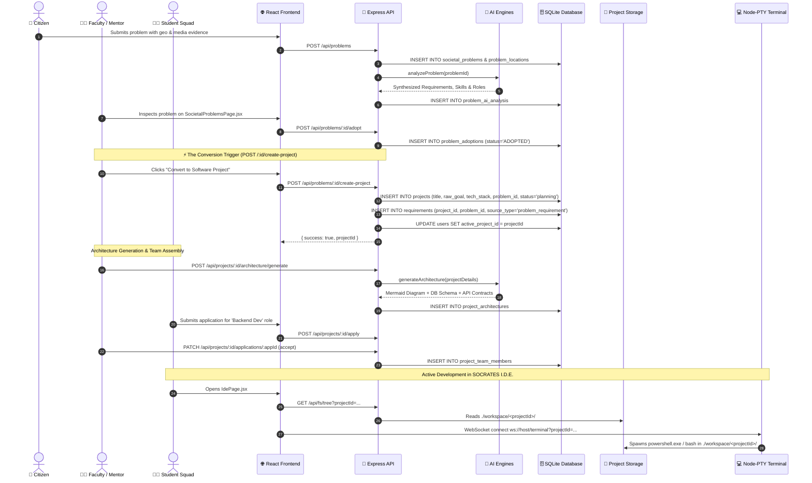
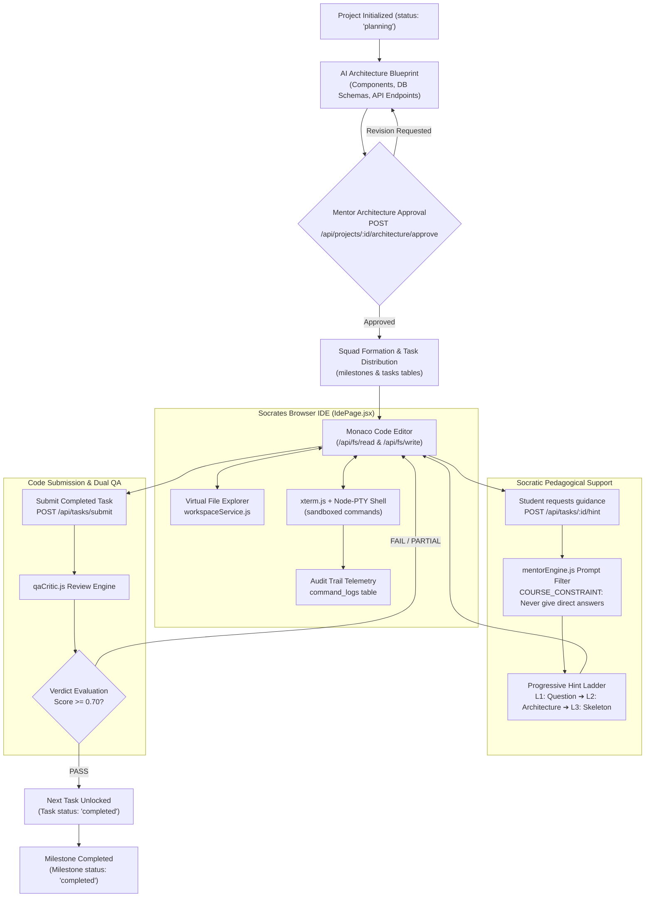
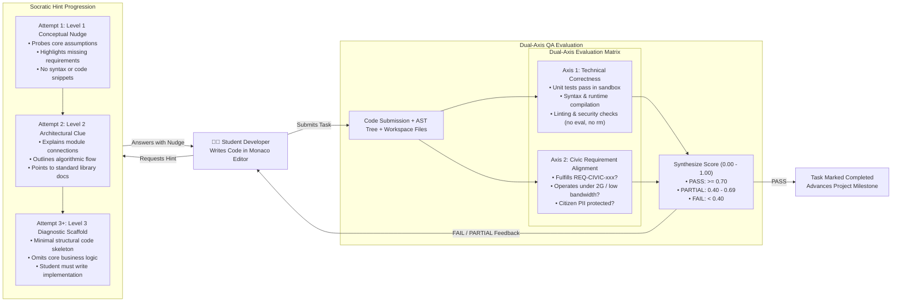
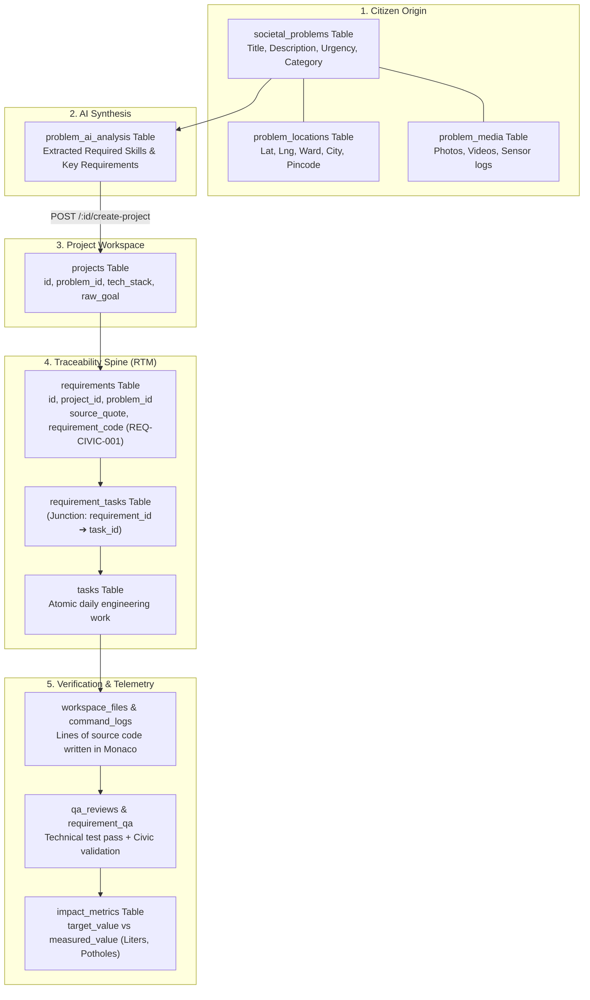
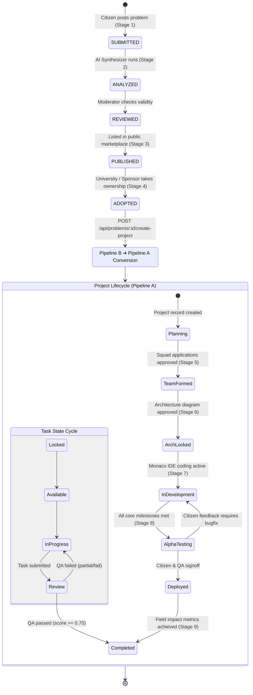
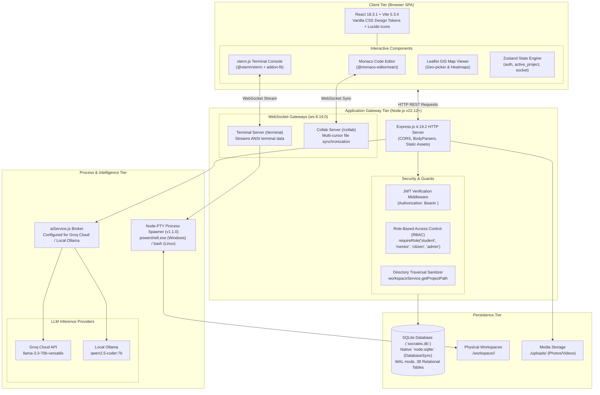

# 🗺️ SOCRATES (PROJECT-SKILL) — PIPELINE WORKFLOW & FLOWCHARTS
## Complete Diagrammatic & Pictorial Architecture Reference

> **Unified System Workflows**: Pipeline B (Civic Acquisition & Intelligence) ➔ Pipeline A (SOCRATES I.D.E. Core Execution Engine)

---

## 📑 Table of Contents

1. [High-Level Pictorial System Topology](#1-high-level-pictorial-system-topology)
2. [Master End-to-End Workflow Flowchart](#2-master-end-to-end-workflow-flowchart)
3. [Pipeline B: In-Depth 9-Stage Civic Lifecycle Flowchart](#3-pipeline-b-in-depth-9-stage-civic-lifecycle-flowchart)
4. [The Critical Handoff: Pipeline B ➔ Pipeline A Sequence Diagram](#4-the-critical-handoff-pipeline-b--pipeline-a-sequence-diagram)
5. [SOCRATES I.D.E. Core Execution Flowchart (Pipeline A)](#5-socrates-ide-core-execution-flowchart-pipeline-a)
6. [Socratic Mentor & Dual-Axis QA Feedback Loop](#6-socratic-mentor--dual-axis-qa-feedback-loop)
7. [Requirements Traceability Matrix (RTM) & Data Flow Diagram](#7-requirements-traceability-matrix-rtm--data-flow-diagram)
8. [Complete System Lifecycle State Machine](#8-complete-system-lifecycle-state-machine)
9. [Physical Technology Stack & Infrastructure Diagram](#9-physical-technology-stack--infrastructure-diagram)
10. [Traceability Index: Codebase Files & Endpoints](#10-traceability-index-codebase-files--endpoints)

---

## 1. High-Level Pictorial System Topology

```
┌───────────────────────────────────────────────────────────────────────────────────────────────────────┐
│                                     SOCRATES DUAL-PIPELINE TOPOLOGY                                │
└──────────────────────────────────────────────────┬────────────────────────────────────────────────────┘
                                                   │
                ┌──────────────────────────────────┴──────────────────────────────────┐
                ▼                                                                     ▼
  ╔═══════════════════════════════════╗                                 ╔═══════════════════════════════════╗
  ║    PIPELINE A: STUDENT DIRECT     ║                                 ║   PIPELINE B: SOCIETAL PROBLEMS   ║
  ║  • Self-directed raw project goal ║                                 ║  • Grassroots citizen pain point  ║
  ║  • Solo / Pair skill building     ║                                 ║  • Geo-tagged (Lat/Lng/Ward)      ║
  ║  • Synthetic requirements         ║                                 ║  • Multimedia evidence (Photo/Vid)║
  ╚═════════════════╦═════════════════╝                                 ╚═════════════════╦═════════════════╝
                    │                                                                     │
                    ▼                                                                     ▼
       ┌────────────────────────┐                                            ┌────────────────────────┐
       │   AI Goal Clarifier    │                                            │  AI Problem Synthesizer│
       │   (goalClarifier.js)   │                                            │ (problemIntelligence)  │
       └────────────┬───────────┘                                            └────────────┬───────────┘
                    │                                                                     │
                    │                                                        ┌────────────▼───────────┐
                    │                                                        │ Community Upvoting &   │
                    │                                                        │ Institutional Adoption │
                    │                                                        └────────────┬───────────┘
                    │                                                                     │
                    └──────────────────────────────────┬──────────────────────────────────┘
                                                       ▼
                                     ┌──────────────────────────────────┐
                                     │     CONVERGENCE & PROJECT HUB    │
                                     │   POST /api/problems/:id/adopt   │
                                     │   POST /api/problems/create-proj │
                                     │   `projects` & `requirements`    │
                                     └─────────────────┬────────────────┘
                                                       │
                                                       ▼
                                     ┌──────────────────────────────────┐
                                     │    AI SYSTEM ARCHITECT ENGINE    │
                                     │  (architectureGenerator.js)     │
                                     │  Mermaid Topology + DB Schemas   │
                                     └─────────────────┬────────────────┘
                                                       │
                                                       ▼
                                     ┌──────────────────────────────────┐
                                     │    STUDENT SQUAD FORMATION       │
                                     │  Role Matrix: FE, BE, QA, Civic  │
                                     └─────────────────┬────────────────┘
                                                       │
                                                       ▼
                                     ┌──────────────────────────────────┐
                                     │    MILESTONE & TASK PLANNER      │
                                     │  Atomic Tasks + Traceable RTM    │
                                     └─────────────────┬────────────────┘
                                                       │
                                                       ▼
 ╔═════════════════════════════════════════════════════════════════════════════════════════════════════╗
 ║                                  SOCRATES I.D.E. CLOUD WORKSPACE                                    ║
 ║  ┌──────────────────────────────────┐                 ┌──────────────────────────────────────────┐  ║
 ║  │       Monaco Code Editor         │ ◄─────────────► │   Socratic AI Mentor (Pedagogical Hints) │  ║
 ║  └─────────────────┬────────────────┘                 └──────────────────────────────────────────┘  ║
 ║                    │                                                                                ║
 ║                    ▼                                                                                ║
 ║  ┌──────────────────────────────────┐                 ┌──────────────────────────────────────────┐  ║
 ║  │   WebSocket Node-PTY Terminal    │ ◄─────────────► │   Dual-Axis QA Critic (Code + Civic)     │  ║
 ║  └──────────────────────────────────┘                 └──────────────────────────────────────────┘  ║
 ╚═════════════════════════════════════════════════════╦═══════════════════════════════════════════════╝
                                                       │
                                                       ▼
                                     ┌──────────────────────────────────┐
                                     │   STAGE 9: DEPLOYMENT & IMPACT   │
                                     │  Docker / VPS / Preview Links    │
                                     │  Live Field Impact Telemetry ROI │
                                     │  Cryptographic Portfolio Badges  │
                                     └──────────────────────────────────┘
```

---

## 2. Master End-to-End Workflow Flowchart

This flowchart illustrates the complete multi-actor system workflow, covering the Citizen, Student Developer, Mentor/University Lead, and System Engines.

```mermaid
flowchart TD
    %% Styling Classes
    classDef citizenClass fill:#fef3c7,stroke:#d97706,stroke-width:2px,color:#92400e;
    classDef studentClass fill:#e0f2fe,stroke:#0284c7,stroke-width:2px,color:#075985;
    classDef mentorClass fill:#fdf4ff,stroke:#c026d3,stroke-width:2px,color:#701a75;
    classDef aiEngineClass fill:#f3e8ff,stroke:#9333ea,stroke-width:2px,color:#581c87;
    classDef coreClass fill:#dcfce7,stroke:#16a34a,stroke-width:2px,color:#14532d;
    classDef storageClass fill:#f1f5f9,stroke:#475569,stroke-width:2px,color:#1e293b;
    classDef impactClass fill:#ffe4e6,stroke:#e11d48,stroke-width:2px,color:#881337;

    %% Entry Nodes
    subgraph INTAKE ["1. Intake & Ingestion Layer"]
        C_Voice["📢 Citizen / Community Rep<br/>(Voice, Text, Ward Geo, Media)"]:::citizenClass
        S_Goal["💡 Student Direct Idea<br/>(Raw Project Concept)"]:::studentClass
    end

    %% Pipeline B Synthesis
    subgraph PIPELINE_B_INTEL ["2. Pipeline B: Problem Intelligence"]
        B_Submit["Problem Submission Gateway<br/>POST /api/problems"]:::coreClass
        B_AI["AI Problem Intelligence & Deduplication<br/>problemIntelligence.js & Jaccard Matcher"]:::aiEngineClass
        B_Market["Civic Marketplace & Upvoting<br/>SocietalProblemsPage.jsx"]:::citizenClass
        B_Adopt["Institutional / CSR Adoption<br/>problem_adoptions table"]:::mentorClass
    end

    %% Pipeline A Clarification
    subgraph PIPELINE_A_INTEL ["2b. Pipeline A: Idea Clarification"]
        A_Clarify["AI Goal Clarifier<br/>goalClarifier.js (3-5 Diagnostic Qs)"]:::aiEngineClass
    end

    %% Convergence
    subgraph CONVERGENCE ["3. The Convergence Point"]
        Handoff{"Handoff Gateway<br/>POST /api/problems/:id/create-project<br/>OR POST /api/goals/confirm"}:::coreClass
        DB_Proj[("Central Project Database<br/>`projects` & `requirements`")]:::storageClass
    end

    %% Architecture & Squad
    subgraph SQUAD_SETUP ["4. Architecture & Squad Assembly"]
        Arch_Gen["AI System Architecture Generator<br/>architectureGenerator.js (Mermaid + Schemas)"]:::aiEngineClass
        Arch_Approve["Mentor Architecture Lock<br/>POST /api/projects/:id/architecture/approve"]:::mentorClass
        Team_Match["Squad Formation & Skill Matching<br/>project_teams & project_team_members"]:::studentClass
        Task_Decomp["Milestone & Task Breakdown<br/>milestoneGenerator.js & taskPlanner.js"]:::aiEngineClass
    end

    %% Active Development (Socrates IDE)
    subgraph SOCRATES_IDE ["5. Active Traceable Execution (Socrates IDE)"]
        IDE_Page["Monaco Cloud Workspace<br/>IdePage.jsx"]:::studentClass
        PTY_Term["Node-PTY Sandboxed Terminal<br/>WebSocket /terminal stream"]:::coreClass
        Socratic_AI["Socratic Pedagogical Mentor<br/>mentorEngine.js (Progressive Hint Ladder)"]:::aiEngineClass
        QA_Gate["Dual-Axis QA Critic<br/>qaCritic.js (Technical + Civic Alignment)"]:::aiEngineClass
    end

    %% Verification & Deployment
    subgraph RELEASE_LAYER ["6. Deployment & Real-World Impact"]
        Alpha_Preview["Citizen Alpha Testing Preview<br/>CitizenDashboardPage.jsx"]:::citizenClass
        Deploy_Pipeline["Production Deployment Pipeline<br/>Docker / Cloud Run / VPS"]:::impactClass
        Impact_Telemetry["Live Field Impact Telemetry<br/>impact_metrics Table (Counters & ROI)"]:::impactClass
        Cred_Cert["Verifiable Student Portfolio Credential<br/>CompletePage.jsx"]:::coreClass
    end

    %% Connectors
    C_Voice --> B_Submit
    B_Submit --> B_AI
    B_AI --> B_Market
    B_Market --> B_Adopt
    B_Adopt -->|Spawns Project| Handoff

    S_Goal --> A_Clarify
    A_Clarify -->|Confirms Spec| Handoff

    Handoff --> DB_Proj
    DB_Proj --> Arch_Gen
    Arch_Gen --> Arch_Approve
    Arch_Approve --> Team_Match
    Team_Match --> Task_Decomp
    Task_Decomp --> IDE_Page

    IDE_Page <--> PTY_Term
    IDE_Page <-->|Hints / Questions| Socratic_AI
    IDE_Page -->|Submit Code Task| QA_Gate
    QA_Gate -->|Verdict: FAIL / PARTIAL| IDE_Page
    QA_Gate -->|Verdict: PASS| Alpha_Preview

    Alpha_Preview -->|Citizen Validated| Deploy_Pipeline
    Alpha_Preview -.->|Citizen Bug / Feedback| IDE_Page
    Deploy_Pipeline --> Impact_Telemetry
    Impact_Telemetry --> Cred_Cert
```



---

## 3. Pipeline B: In-Depth 9-Stage Civic Lifecycle Flowchart

Each stage of Pipeline B details the frontend page, backend route, database mutations, and external actors:

```mermaid
flowchart TD
    %% Stage 1
    subgraph STAGE_1 ["Stage 1: Citizen Voices & Problems"]
        S1_User["Citizen / NGO / Panchayat"]
        S1_UI["Frontend: ProblemSubmitPage.jsx<br/>(Leaflet Map Picker + File Dropzone)"]
        S1_API["POST /api/problems<br/>(Multer 50MB Multipart Guard)"]
        S1_DB[("Tables: societal_problems,<br/>problem_locations, problem_media")]
        S1_User --> S1_UI --> S1_API --> S1_DB
    end

    %% Stage 2
    subgraph STAGE_2 ["Stage 2: AI Problem Synthesizer & Deduplication"]
        S2_Eng["problemIntelligence.js<br/>(Groq Cloud / Local Ollama)"]
        S2_Algo["Jaccard Token Metric + 3-Gram Overlap<br/>Feasibility Scoring (0-100)"]
        S2_DB[("Tables: problem_ai_analysis,<br/>problem_duplicates")]
        S1_DB --> S2_Eng --> S2_Algo --> S2_DB
    end

    %% Stage 3
    subgraph STAGE_3 ["Stage 3: Community Voting & Prioritization"]
        S3_UI["Frontend: SocietalProblemsPage.jsx<br/>& ProblemDetailPage.jsx"]
        S3_Vote["POST /api/problems/:id/interest<br/>Priority Score Calculation"]
        S3_DB[("Table: problem_interests<br/>(upvote, resident, volunteer)")]
        S2_DB --> S3_UI --> S3_Vote --> S3_DB
    end

    %% Stage 4
    subgraph STAGE_4 ["Stage 4: Institutional / Sponsor Adoption"]
        S4_Mentor["University Faculty / CSR Sponsor"]
        S4_API["POST /api/problems/:id/adopt<br/>(Pledges credits, funding, mentor hours)"]
        S4_DB[("Table: problem_adoptions<br/>Status: ADOPTED")]
        S3_DB --> S4_Mentor --> S4_API --> S4_DB
    end

    %% Stage 5
    subgraph STAGE_5 ["Stage 5: Student Team Matching & Squad Assembly"]
        S5_Students["Students Apply via ProjectTeamPage.jsx"]
        S5_API["POST /api/projects/:id/apply<br/>PATCH /api/projects/:id/applications/:appId"]
        S5_DB[("Tables: project_student_applications,<br/>project_teams, project_team_members")]
        S4_DB --> S5_Students --> S5_API --> S5_DB
    end

    %% Stage 6
    subgraph STAGE_6 ["Stage 6: Architecture & Requirements Traceability (RTM)"]
        S6_Arch["AI Architect: architectureGenerator.js<br/>Mermaid Topology + DB Schemas"]
        S6_RTM["Requirements Matrix (RTM)<br/>REQ-CIVIC-xxx ➔ Technical Tasks"]
        S6_DB[("Tables: project_architectures,<br/>requirements, requirement_tasks")]
        S5_DB --> S6_Arch --> S6_RTM --> S6_DB
    end

    %% Stage 7
    subgraph STAGE_7 ["Stage 7: Monaco IDE + Civic Socratic Mentor"]
        S7_IDE["IdePage.jsx + terminalService.js<br/>Node-PTY Pseudo-Terminal (/terminal)"]
        S7_Mentor["mentorEngine.js<br/>Civic Edge Constraints (2G, PII, WCAG)"]
        S7_DB[("Tables: workspace_files,<br/>command_logs, conversation_turns")]
        S6_DB --> S7_IDE <--> S7_Mentor --> S7_DB
    end

    %% Stage 8
    subgraph STAGE_8 ["Stage 8: Community Alpha Testing & Dual QA"]
        S8_QA["Dual-Axis QA Critic (qaCritic.js)<br/>Axis 1: Code Tests | Axis 2: Citizen Need"]
        S8_Citizen["Citizen Preview on CitizenDashboardPage.jsx<br/>Real feedback & star rating"]
        S8_DB[("Tables: qa_reviews,<br/>requirement_qa")]
        S7_DB --> S8_QA <--> S8_Citizen --> S8_DB
    end

    %% Stage 9
    subgraph STAGE_9 ["Stage 9: Real Deployment + Field Impact Telemetry"]
        S9_Deploy["Production Deployment<br/>(Docker / Cloud Run / Static Previews)"]
        S9_Metric["Field Telemetry Gauges<br/>ProjectImpactPage.jsx (Liters, Potholes, People)"]
        S9_DB[("Tables: impact_metrics,<br/>projects (status: COMPLETED)")]
        S8_DB --> S9_Deploy --> S9_Metric --> S9_DB
    end
```



---

## 4. The Critical Handoff: Pipeline B ➔ Pipeline A Sequence Diagram

The bridge where an adopted community problem transitions into an active development workspace (`backend/src/routes/problems.js`):



---

## 5. SOCRATES I.D.E. Core Execution Flowchart (Pipeline A)

The active student development cycle inside the browser IDE:



---

## 6. Socratic Mentor & Dual-Axis QA Feedback Loop

The diagram below details the two feedback mechanisms that keep students learning without cheating and ensure code meets both technical and civic criteria:



---

## 7. Requirements Traceability Matrix (RTM) & Data Flow Diagram

How citizen inputs are tracked through code commits, automated QA runs, and field impact telemetry:



---

## 8. Complete System Lifecycle State Machine

The unified state machine governing problems, projects, team applications, and tasks:



---

## 9. Physical Technology Stack & Infrastructure Diagram

The runtime environment hosting the application:



---

## 10. Traceability Index: Codebase Files & Endpoints

| Stage / Component | Frontend Screen | Backend Route / File | Core Engine | Primary DB Tables |
|---|---|---|---|---|
| **Stage 1: Citizen Voices** | [`ProblemSubmitPage.jsx`](file:///c:/Project-Skill/P-S/frontend/src/pages/ProblemSubmitPage.jsx) | `POST /api/problems` in [`problems.js`](file:///c:/Project-Skill/P-S/backend/src/routes/problems.js) | Multer Media Parser | `societal_problems`, `problem_locations`, `problem_media` |
| **Stage 2: AI Synthesizer** | [`ProblemDetailPage.jsx`](file:///c:/Project-Skill/P-S/frontend/src/pages/ProblemDetailPage.jsx) | `POST /api/problems/:id/analyze` | [`problemIntelligence.js`](file:///c:/Project-Skill/P-S/backend/src/engines/problemIntelligence.js) | `problem_ai_analysis`, `problem_duplicates` |
| **Stage 3: Community Voting** | [`SocietalProblemsPage.jsx`](file:///c:/Project-Skill/P-S/frontend/src/pages/SocietalProblemsPage.jsx) | `POST /api/problems/:id/interest` | Trend Ranker Algorithm | `problem_interests` |
| **Stage 4: Institutional Adoption** | [`ProblemDetailPage.jsx`](file:///c:/Project-Skill/P-S/frontend/src/pages/ProblemDetailPage.jsx) | `POST /api/problems/:id/adopt` | Adoption Controller | `problem_adoptions` |
| **Convergence Handoff** | [`ProblemDetailPage.jsx`](file:///c:/Project-Skill/P-S/frontend/src/pages/ProblemDetailPage.jsx) | `POST /api/problems/:id/create-project` | Conversion Controller | `projects`, `requirements` |
| **Pipeline A Entry** | [`GoalPage.jsx`](file:///c:/Project-Skill/P-S/frontend/src/pages/GoalPage.jsx) | `POST /api/goals/clarify` | [`goalClarifier.js`](file:///c:/Project-Skill/P-S/backend/src/engines/goalClarifier.js) | `projects`, `milestones` |
| **Stage 5: Team Formation** | [`ProjectTeamPage.jsx`](file:///c:/Project-Skill/P-S/frontend/src/pages/ProjectTeamPage.jsx) | `POST /api/projects/:id/apply` | [`projectExtensions.js`](file:///c:/Project-Skill/P-S/backend/src/routes/projectExtensions.js) | `project_student_applications`, `project_teams`, `project_team_members` |
| **Stage 6: Architecture & RTM** | [`ProjectArchitecturePage.jsx`](file:///c:/Project-Skill/P-S/frontend/src/pages/ProjectArchitecturePage.jsx) | `POST /:id/architecture/generate` | [`architectureGenerator.js`](file:///c:/Project-Skill/P-S/backend/src/engines/architectureGenerator.js) | `project_architectures`, `requirements`, `requirement_tasks` |
| **Stage 7: Monaco & Socratic IDE** | [`IdePage.jsx`](file:///c:/Project-Skill/P-S/frontend/src/pages/IdePage.jsx) | WS `/terminal` & `POST /:id/hint` | [`terminalService.js`](file:///c:/Project-Skill/P-S/backend/src/services/terminalService.js), [`mentorEngine.js`](file:///c:/Project-Skill/P-S/backend/src/engines/mentorEngine.js) | `workspace_files`, `command_logs`, `conversation_turns` |
| **Stage 8: Dual-Axis QA** | [`ProjectRequirementsPage.jsx`](file:///c:/Project-Skill/P-S/frontend/src/pages/ProjectRequirementsPage.jsx) | `POST /api/tasks/submit` | [`qaCritic.js`](file:///c:/Project-Skill/P-S/backend/src/engines/qaCritic.js) | `qa_reviews`, `requirement_qa` |
| **Stage 9: Field Impact** | [`ProjectImpactPage.jsx`](file:///c:/Project-Skill/P-S/frontend/src/pages/ProjectImpactPage.jsx) | `GET /:id/impact`, `POST /:id/impact` | Telemetry Aggregator | `impact_metrics` |
| **Stage 9: Completion** | [`CompletePage.jsx`](file:///c:/Project-Skill/P-S/frontend/src/pages/CompletePage.jsx) | `GET /api/projects/:id` | Portfolio Verification | `projects` (status: `completed`) |

---
*Created as the definitive visual architecture companion for SOCRATES (PROJECT-SKILL).*
